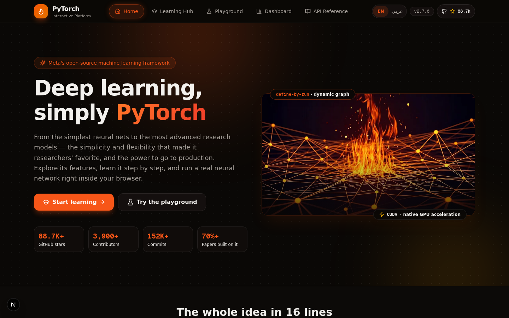
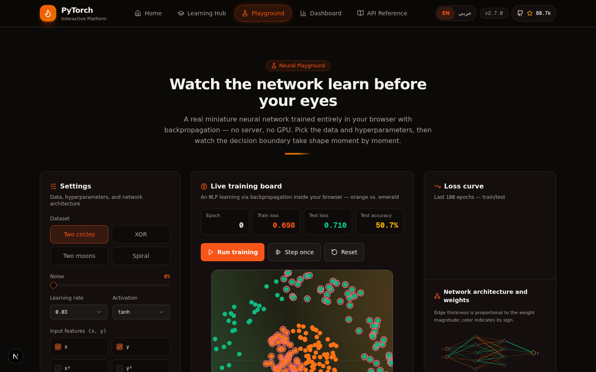
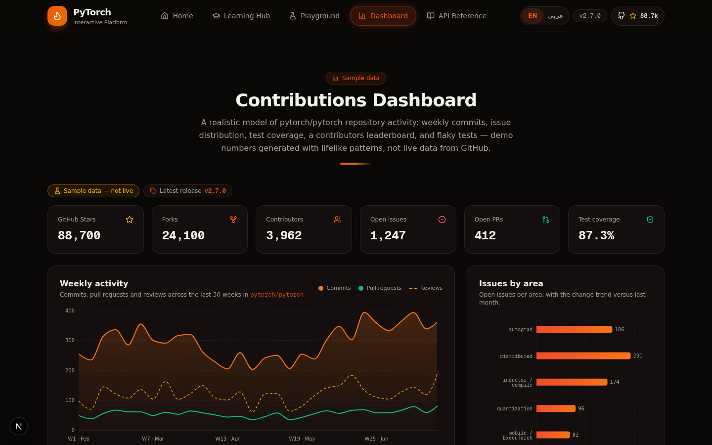
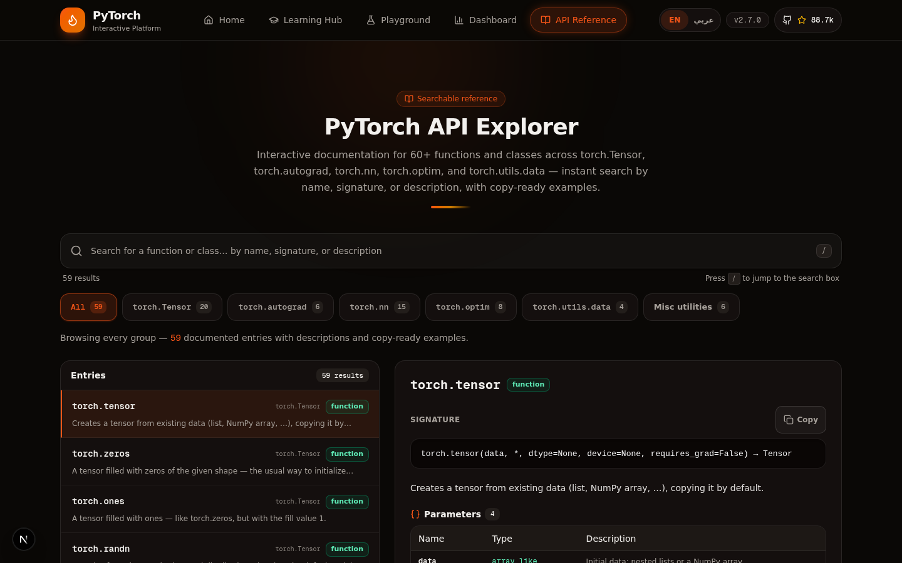
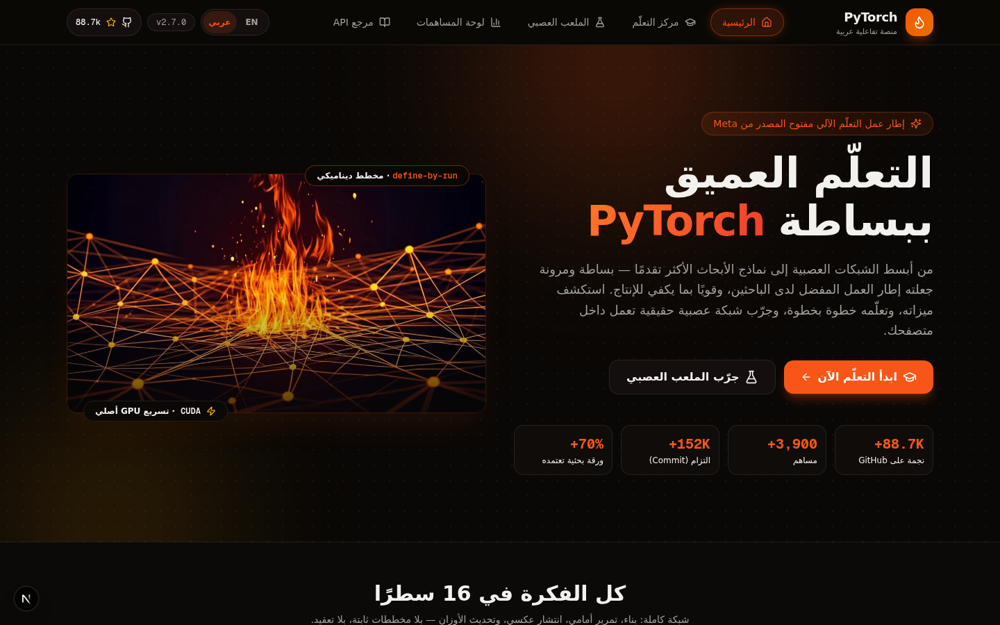
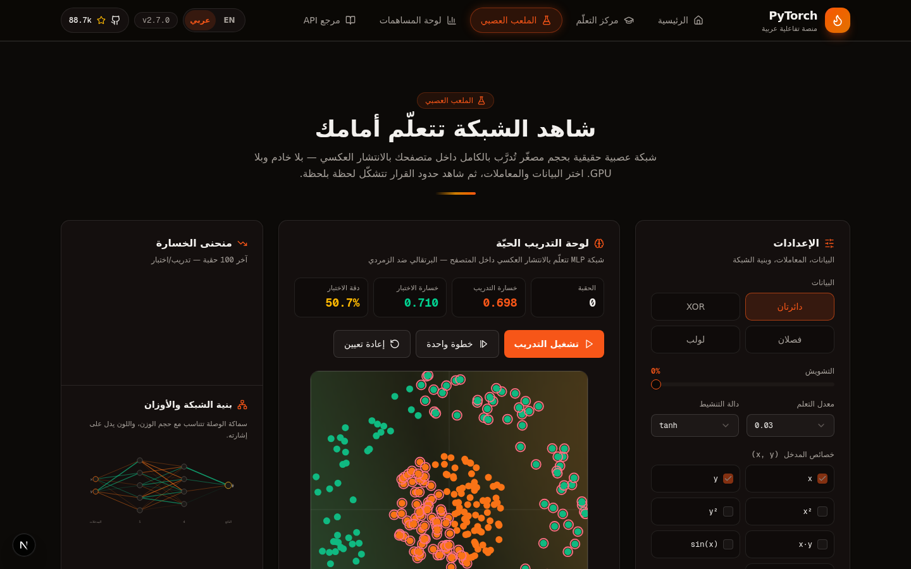

<div dir="ltr">

# 🔥 PyTorch — Interactive Platform

**A stunning bilingual (English / العربية) showcase, learning hub, and in-browser neural network playground for the PyTorch ecosystem — built with Next.js 16.**

[](https://moustaphabouzianne95-boop.github.io/pytorch/)

> 🌐 **Try it now:** <https://moustaphabouzianne95-boop.github.io/pytorch/> — fully static, no server required.

[](https://nextjs.org)
[](https://www.typescriptlang.org)
[](https://tailwindcss.com)
[](https://ui.shadcn.com)
[](https://www.prisma.io)
[](#)

</div>

---

<div dir="rtl">

## 🌟 بالعربية

منصة تفاعلية ثنائية اللغة (العربية / English) مخصّصة لإطار عمل **PyTorch** للتعلم العميق — تجمع بين صفحة تعريف أنيقة، مركز تعلّم خطوة بخطوة، ملعب شبكات عصبية حقيقي يعمل داخل المتصفح، لوحة بيانات للمساهمات، ومرجع قابل للبحث لواجهات PyTorch البرمجية — كل ذلك بتصميم داكن أنيق بألوان PyTorch البرتقالية ودعم كامل للكتابة من اليمين إلى اليسار (RTL).

</div>

---

## 📸 Screenshots | لقطات الشاشة

### English — LTR

| Home | Neural Playground |
| --- | --- |
|  |  |

| Contributions Dashboard | API Reference |
| --- | --- |
|  |  |

### العربية — RTL (كامل من اليمين إلى اليسار)

| الرئيسية | الملعب العصبي |
| --- | --- |
|  |  |

---

<div dir="ltr">

## ✨ What's Inside

### 🏠 Overview
A cinematic landing page covering what PyTorch is, **why researchers reach for it first**, what you can build inside it, and where it shines — with a "whole idea in 16 lines" annotated code walkthrough.

### 🎓 Learning Hub
Step-by-step interactive lessons (tensors → autograd → building models → training loops) fetched from `GET /api/lessons`, with syntax-highlighted code and expected outputs in both languages.

### 🧪 Neural Playground
**A real miniature neural network trained entirely in your browser** — no server, no GPU, no ML libraries:
- Pure-TypeScript backpropagation engine (`playground-engine.ts`)
- 4 datasets: two circles, XOR, two moons, spiral — with adjustable noise
- Feature transforms (`x, y, x², y², x·y, sin(x), sin(y)`) and 0–4 hidden layers × up to 8 neurons
- Live decision-boundary canvas, train/test loss sparkline, and an SVG network graph where **edge thickness ∝ weight magnitude** and color = sign
- tanh / ReLU / sigmoid activations, adjustable learning rate, mini-batch training

### 📊 Contributions Dashboard
A realistic model of `pytorch/pytorch` repository activity — weekly commits, PRs, reviews, issue distribution by area, contributors leaderboard, and test coverage — clearly labeled as **sample data, not live GitHub stats**.

### 🔎 API Reference
A searchable, master–detail explorer of 60 PyTorch APIs across 6 scopes (`torch.Tensor`, `nn`, `autograd`, `optim`, and more) with signatures, types, and descriptions — press <kbd>/</kbd> to search.

### 🌍 Bilingual by Design
- One-click **EN ⇄ عربي** switch in the navbar (preference persisted)
- Full **RTL layout mirroring** for Arabic (fonts: Cairo + Geist Mono for code)
- Code blocks, signatures, and numeric readouts stay **LTR inside RTL** — the way technical content should be

## 🚀 Getting Started

**Prerequisites:** [Node.js 20+](https://nodejs.org) or [Bun](https://bun.sh), and any machine — everything runs locally.

```bash
# 1. Clone
git clone https://github.com/moustaphabouzianne95-boop/pytorch.git
cd pytorch

# 2. Install dependencies
bun install        # or: npm install

# 3. Set up the database (SQLite via Prisma)
bun run db:push    # or: npm run db:push

# 4. Start the dev server
bun run dev        # or: npm run dev
```

Then open **http://localhost:3000** — the site defaults to Arabic RTL; switch to English anytime from the navbar.

## 🗂 Project Structure

```
src/
├── app/
│   ├── page.tsx              # Single-page app with all 5 sections
│   ├── layout.tsx            # RTL-first root layout, Cairo font
│   └── api/
│       ├── lessons/route.ts  # GET — learning-hub lessons
│       ├── docs/route.ts     # GET — API reference data
│       └── contributions/    # GET — dashboard sample data
├── components/
│   ├── site/                 # Navbar, footer, app shell, code block
│   └── sections/             # Overview, learning-hub, playground (+ engine),
│                             #   dashboard, api-explorer
├── data/                     # Typed content modules (lessons, docs, contributions)
└── lib/
    ├── i18n.tsx              # EN/AR dictionary + language context + RTL switch
    └── types.ts              # Shared TypeScript contracts
```

## 🛠 Tech Stack

| Layer | Choice |
| --- | --- |
| Framework | Next.js 16 (App Router) + TypeScript 5 |
| UI | Tailwind CSS 4 + shadcn/ui + Radix primitives + Lucide icons |
| State / Data | Prisma ORM (SQLite) · REST API routes · React context |
| Charts | Recharts |
| Animation | Framer Motion |
| ML Engine | Custom pure-TypeScript backpropagation (zero dependencies) |

## 🌐 Deployment (GitHub Pages)

The site is **fully static-exported** and auto-deployed:

- On every push to `main`, the GitHub Action [`.github/workflows/deploy-pages.yml`](.github/workflows/deploy-pages.yml) runs `bun run build:static` (`STATIC_EXPORT=1 next build`) which:
  - exports the app to pure HTML/JS/CSS in `out/` with `basePath: /pytorch`
  - evaluates the GET-only API routes at **build time** into static JSON files (`out/api/lessons`, `out/api/docs`, `out/api/contributions`)
- The artifact is published to **https://moustaphabouzianne95-boop.github.io/pytorch/**

To run the export locally: `bun run build:static`, then serve the `out/` folder behind a `/pytorch/` path.

## 🤝 Contributing

Ideas, bug reports, and PRs are welcome — open an issue or a pull request!

## 📄 License

MIT — see [`LICENSE`](LICENSE).

</div>

---

<div dir="rtl" align="center">

صُنع بشغف لمجتمع PyTorch العربي والعالمي 🔥

</div>
